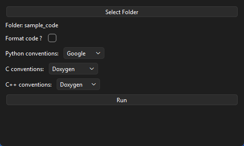

# Auto Code Documentation & Formatting

An AI-powered desktop tool that scans a codebase, generates documentation for
undocumented functions, classes, and structs using a **local** LLM, and can
reformat the code to match preferred styles — all running entirely on
your own machine. Your source code is never uploaded anywhere.



## Why local?

Sending a private codebase to a third-party API isn't always an option —
sometimes it isn't allowed at all. This project runs the documentation model
entirely on your own hardware via [Ollama](https://ollama.com), so nothing
ever leaves your machine.

## Features

- **Scans Python, C, and C++** — Python is parsed with the standard library
  `ast` module; C/C++ is parsed with `tree-sitter` (via
  `tree-sitter-language-pack`), pulling out every function, class, and struct.
- **Generates documentation with a local LLM** — powered by
  [Ollama](https://ollama.com) running `qwen2.5-coder:14b` by default. No API
  key, no internet connection required once the model is pulled.
- **Multiple documentation conventions per language**:
  - Python: Google, NumPy, Sphinx
  - C: Doxygen, Kernel-doc
  - C++: Doxygen
- **Non-destructive by default** — generated docs are written to a separate
  `docs/` folder as Markdown, one file per source file scanned. Your original
  source is never modified by the documentation step.
- **Optional code formatting** — runs `black` (Python) or `clang-format`
  (C/C++) and writes the result to a `formatted_files/` folder, ready to
  review before you replace anything.
- **PySide6 GUI** — pick a folder, choose a convention per language, tick a
  box to also format the code, and watch a live per-file progress bar while
  it runs.
- **Skips what's already documented** — Python functions/classes that
  already have a docstring are left alone rather than being overwritten
  (see [Known limitations](#known-limitations) for the current C/C++ gap).

## Tech stack

| Piece                | Tool                                                      |
|-----------------------|------------------------------------------------------------|
| Language              | Python 3.11+                                                |
| GUI                   | [PySide6](https://doc.qt.io/qtforpython/) (Qt for Python)  |
| Python parsing        | Standard library `ast`                                     |
| C / C++ parsing       | [`tree-sitter-language-pack`](https://pypi.org/project/tree-sitter-language-pack/) |
| Local inference       | [Ollama](https://ollama.com), default model `qwen2.5-coder:14b` |
| Python formatting     | [`black`](https://github.com/psf/black)                    |
| C / C++ formatting    | [`clang-format`](https://pypi.org/project/clang-format/) (pip-installable) |
| HTTP client           | [`requests`](https://pypi.org/project/requests/)            |

## Project structure

```
.
├── scanner.py               # Walks a codebase; extracts functions/classes/structs
├── ollama_client.py         # Thin wrapper around the local Ollama REST API + prompt building
├── pipeline.py               # Shared core logic: scan -> generate docs -> (optionally) format
├── doc_writer.py             # Writes generated documentation to docs/*.md
├── formatter.py               # Runs black / clang-format on a file
├── formatted_file_writer.py   # Writes formatted output to formatted_files/
├── main.py                   # CLI entry point (see Known limitations)
├── gui.py                     # PySide6 GUI entry point (recommended way to run this)
├── sample_code/               # Small example.py / example.c / example.cpp fixtures
├── requirements.txt
└── run.bat                    # Windows convenience script: activates venv, runs main.py
```

## Getting started

You can either run this from source (any OS with Python + Ollama) or, on
Windows, download a standalone `.exe` that doesn't need Python installed at
all — see [Building a standalone Windows executable](BUILD.md).

### 1. Install and start Ollama

Download and install from [ollama.com/download](https://ollama.com/download).
On Windows and macOS it runs quietly in the background after install; on
Linux you may need to start it yourself:

```bash
ollama serve
```

### 2. Pull a model

```bash
ollama pull qwen2.5-coder:14b
```

That model expects a reasonably capable GPU (developed against an 18GB VRAM
card). On a laptop with no dedicated GPU, pull a smaller model instead and
update `DEFAULT_MODEL` in `ollama_client.py` to match:

```bash
ollama pull qwen3:4b
```

### 3. Set up Python

```bash
python -m venv venv
venv\Scripts\activate          # macOS/Linux: source venv/bin/activate
pip install -r requirements.txt
```

> Virtual environments aren't portable — if you clone this onto a new
> machine (or rename the folder), delete `venv/` and recreate it rather than
> copying it over.

### 4. Run it

```bash
python gui.py
```

Or on Windows, just double-click `run.bat`.

In the GUI: pick a folder, choose a documentation convention for each
language, tick **Format code?** if you also want a formatted copy written
out, and hit **Run**. Progress is shown per function/class/struct as it's
processed. When it finishes, check the `docs/` folder (generated
documentation) and, if you ticked the box, `formatted_files/` (formatted
copies) inside the project folder.

To try it safely first without pointing it at a real project, run it against
the bundled `sample_code/` folder.

## Known limitations

This is an actively-developed learning project, and these are open items
rather than secrets:

- **CLI convention selection is broken** (`main.py`) — the command-line
  entry point currently passes the *available* conventions per language
  instead of one *selected* convention per language, so it errors out as
  soon as it needs to generate a docstring. **Use the GUI (`gui.py`) for
  now** — it builds the selection correctly. Tracked as a fix for a future
  pass.
- **"Already documented" detection only works for Python** — C/C++ files are
  always treated as undocumented, even if they already have a Doxygen/
  kernel-doc comment, because `scan_c_family_file` doesn't check for one
  yet. Python's `ast.get_docstring` path already handles this correctly.
- **macOS/Linux are untested** — development and testing so far has been on
  Windows. The code has no obvious Windows-only dependencies, but this
  hasn't been verified end-to-end on another OS yet.

## Roadmap

- [x] Codebase scanner (Python + C/C++) and local LLM hookup
- [x] Full pipeline: doc generation + formatter, wired end-to-end
- [x] PySide6 GUI with per-language conventions, live progress, and a
      double-click guard on Run
- [x] Standalone Windows executable (no Python required to run it)
- [ ] Fix CLI convention selection (`main.py`)
- [ ] Detect existing documentation in C/C++ files, not just Python
- [ ] Verify and support macOS/Linux
- [ ] Explore a custom-tuned local model

## Troubleshooting

- **`ConnectionError: Could not reach Ollama`** — Ollama isn't running.
  Run `ollama serve` in another terminal, or check it's installed at all.
- **`RuntimeError: Model not found`** — you haven't pulled that model yet,
  or the tag doesn't match. Run `ollama list` to see what you have locally,
  and check `DEFAULT_MODEL` in `ollama_client.py`.
- **C/C++ files return 0 results** — `tree-sitter-language-pack` probably
  didn't install cleanly. Python scanning still works without it; check
  `pip show tree-sitter-language-pack`.
- **`clang not installed, please install clang`** — the pip-installed
  `clang-format` package wasn't picked up on your `PATH`. Confirm your venv
  is active (you should see `(venv)` in the prompt) and
  `pip show clang-format` succeeds.
- **Everything is very slow** — expected for larger models on CPU-only or
  low-VRAM machines. Drop to a smaller model tag (see step 2 above).
- **VS Code / terminal seems to ignore installed packages** — you're
  probably running the system/Store Python instead of the venv's. Confirm
  `(venv)` shows in the terminal prompt and the correct interpreter is
  selected in VS Code.

## License

This project is licensed under the MIT License — see [LICENSE](LICENSE) for
details.

